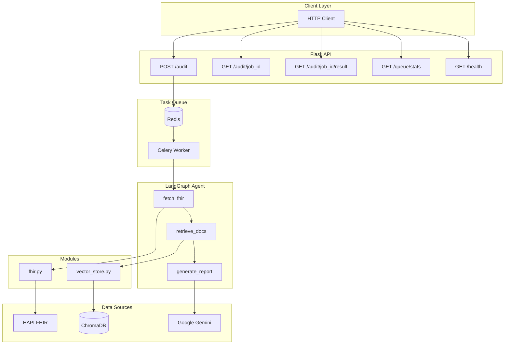
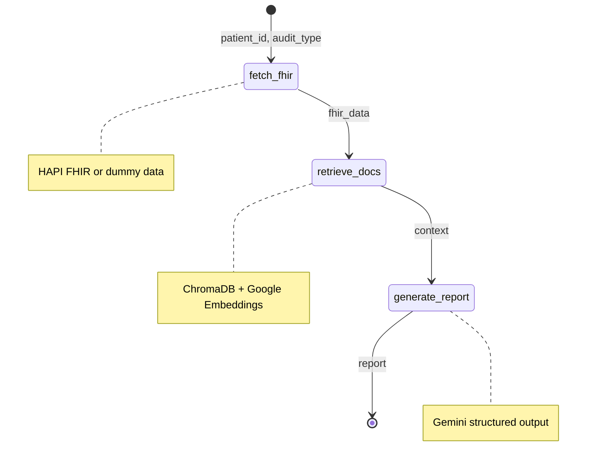

# MedAudit Aiorchestrator – Architecture

## High-Level Overview

```
┌─────────────────────────────────────────────────────────────────────────────────────┐
│                              MedAudit Aiorchestrator                                  │
├─────────────────────────────────────────────────────────────────────────────────────┤
│                                                                                       │
│   ┌──────────────┐      ┌──────────────┐      ┌──────────────┐      ┌─────────────┐ │
│   │   Client     │─────▶│  Flask API   │─────▶│    Redis     │◀────▶│   Celery    │ │
│   │  (HTTP)      │      │  (main.py)   │      │   Broker     │      │   Worker    │ │
│   └──────────────┘      └──────────────┘      └──────────────┘      └──────┬──────┘ │
│         │                       │                        │                     │     │
│         │                       │                        │                     │     │
│         ▼                       ▼                        │                     ▼     │
│   ┌──────────────┐      ┌──────────────┐                │              ┌──────────┐ │
│   │ POST /audit  │      │ GET /audit/  │                │              │ LangGraph│ │
│   │ GET /health  │      │   <job_id>   │                │              │  Agent   │ │
│   └──────────────┘      └──────────────┘                │              └────┬─────┘ │
│                                                                              │       │
│   ┌──────────────────────────────────────────────────────────────────────────┼───┐  │
│   │                         LangGraph StateGraph                              │   │  │
│   │   ┌────────────┐    ┌─────────────┐    ┌────────────────┐                 │   │  │
│   │   │ fetch_fhir │───▶│retrieve_docs│───▶│ generate_report│─────────────────┘   │  │
│   │   └─────┬──────┘    └──────┬──────┘    └───────┬────────┘                     │  │
│   │         │                  │                   │                              │  │
│   └─────────┼──────────────────┼───────────────────┼──────────────────────────────┘  │
│             │                  │                   │                                  │
│             ▼                  ▼                   ▼                                  │
│   ┌─────────────────┐  ┌─────────────────┐  ┌─────────────────┐                      │
│   │ HAPI FHIR /     │  │ ChromaDB        │  │ Google Gemini   │                      │
│   │ Dummy Data      │  │ (Embeddings +   │  │ (ChatGoogle     │                      │
│   │ (fhir.py)       │  │  Guidelines)    │  │  GenerativeAI)  │                      │
│   └─────────────────┘  └─────────────────┘  └─────────────────┘                      │
│                                                                                       │
└─────────────────────────────────────────────────────────────────────────────────────┘
```

---

## Component Diagram (Mermaid)



---

## LangGraph Workflow Detail



---

## Directory Structure

```
aiorchestrator/
├── main.py                    # Flask app: HTTP API, Celery task dispatch
├── pyproject.toml
├── ARCHITECTURE.md            # This file
├── start_worker.sh            # Start Celery worker (requires Redis)
│
├── aiorchestrator/            # Python package
│   ├── __init__.py
│   ├── celery_app.py         # Celery config (Redis broker)
│   ├── tasks.py              # run_patient_audit Celery task
│   │
│   └── app/
│       ├── __init__.py
│       ├── agent.py          # LangGraph StateGraph (fetch_fhir → retrieve_docs → generate_report)
│       ├── fhir.py           # fetch_patient_bundle, format_patient_summary
│       └── vector_store.py   # ChromaDB + Google Embeddings, ingest_guidelines
│
├── tests/
│   ├── test_fhir_client.py
│   ├── test_fhir_reader_adapter.py
│   ├── test_guidelines.py
│   ├── test_orchestrator.py
│   ├── test_prompt_builder.py
│   └── test_breast_cancer_screening.py
│
├── ingest_guidelines.py       # CLI: python ingest_guidelines.py [--kb-path PATH] [--force]
├── breast_cancer_screening_guidelines.md  # Domain guideline (ingested into ChromaDB)
├── BREAST_CANCER_MVP_GUIDE.md
├── LIVE_TEST_RESULTS.md
├── TEST_REPORT.md
├── DEMO_RESPONSES.md
└── .env                       # GOOGLE_API_KEY, REDIS_URL, HAPI_FHIR_URL, USE_DUMMY_FHIR, MEDICAL_KB_PATH
```

---

## Data Flow

| Stage | Input | Output |
|-------|-------|--------|
| **POST /audit** | `{patient_id, audit_type}` | `{status: "queued", job_id, check_status}` (202 Accepted) |
| **Celery Task** | `patient_id, audit_type` | Queued → Worker |
| **fetch_fhir** | `patient_id` | `fhir_data` (FHIR Bundle) |
| **format_patient_summary** | `fhir_data` | Narrative string |
| **retrieve_docs** | `audit_type + patient_summary` | `context` (guideline chunks) |
| **generate_report** | `patient_summary, context, audit_type` | `report` (JSON: compliant, gaps, evidence) |
| **Task Result** | — | `{status, report, sources}` |

---

## Quick Start

| Command | Purpose |
|---------|---------|
| `uv run python main.py` | Start Flask API (port 5001) |
| `./start_worker.sh` | Start Celery worker (requires Redis) |
| `uv run python ingest_guidelines.py --kb-path ../docs/Medical_KB` | Load guidelines into ChromaDB |
| `curl -X POST http://localhost:5001/audit -H "Content-Type: application/json" -d '{"patient_id":"123","audit_type":"breast_cancer_screening"}'` | Submit audit job |

---

## External Dependencies

| Component | Purpose |
|-----------|---------|
| **Redis** | Celery message broker & result backend |
| **HAPI FHIR** | Patient data via `$everything` (or dummy if `USE_DUMMY_FHIR=true`) |
| **ChromaDB** | Vector store for clinical guidelines (local `./chroma_data`) |
| **Google Gemini** | LLM (gemini-2.0-flash-exp) + Embeddings (gemini-embedding-001) |

### Audit Types (examples)

- `cardiology_compliance`, `breast_cancer_screening`, `hypertension`, `diabetes_management`, `general`
